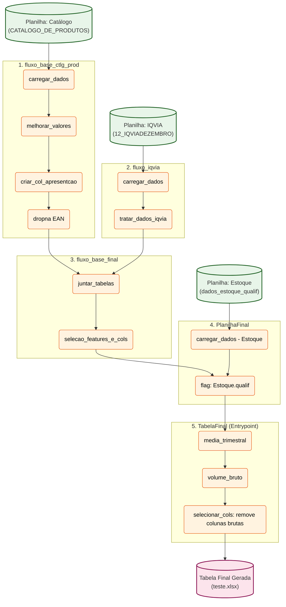

# Diagrama do Fluxo de Dados

Com base na sua documentação (`DOCUMENTACAO_PIPELINE.md`), eu construí este diagrama Mermaid ilustrando a arquitetura do seu fluxo no Prefect, mostrando desde o carregamento das origens de dados até a exportação final.

### O que o diagrama demonstra:
1. **Fontes de Dados (Verde):** A leitura das 3 planilhas principais de forma segmentada.
2. **Pipelines / Flows (Caixas grandes):** Agrupamento que mostra como cada nível é isolado, mas alimenta o fluxo superior.
3. **Tarefas (Laranja):** Detalhamento das funções atômicas gerenciadas pelas Flows em sua ordem respectiva.
4. **Produto Final (Rosa):** Ponto de exportação para a planilha excel contendo as métricas trimestrais.
