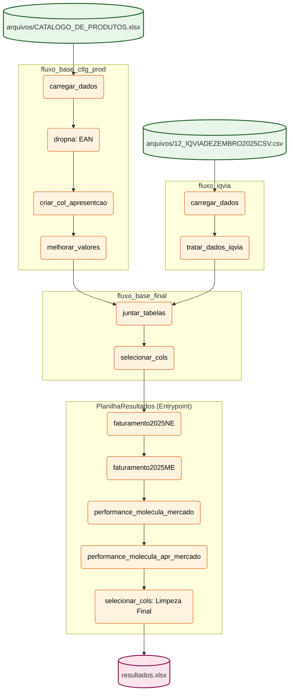

# Diagrama do Fluxo de Dados (Pipeline de Estoque)

Este diagrama representa a arquitetura atualizada do fluxo de dados orquestrado pelo Prefect, conforme definido em `fluxo_main.py`.

### Explicação do Fluxo:
1.  **Ingestão**: Os dados do Catálogo e da IQVIA são lidos e tratados em sub-fluxos isolados.
2.  **Unificação**: O `fluxo_base_final` combina as fontes em um único DataFrame filtrado.
3.  **Processamento de Negócio**: O fluxo principal (`PlanilhaResultados`) aplica as quatro tarefas de cálculo de performance e faturamento.
4.  **Entrega**: O resultado é limpo de colunas temporárias e salvo como Excel.
